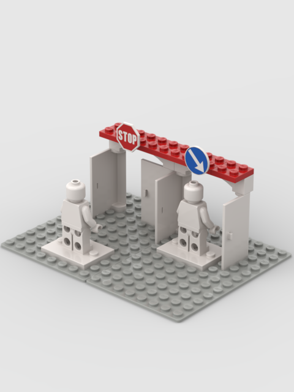

# StudCraft Construction Components

**Version:** 0.2.0 Draft

---

# Purpose

This document defines the functional construction components used in StudCraft.

Components are physical LEGO elements that provide gameplay functionality.

What a component does once it exists is defined by the system that owns that capability.

---

# Design Philosophy

StudCraft uses construction instead of hidden statistics.

Players should be able to identify the purpose of every important component simply by looking at the model.

Components define capabilities.

They do not define abstract statistics.

---

# CMP-001 — Functional Components

A functional component is a physical part of a model that affects gameplay.

Decorative elements have no gameplay effect unless another rule gives them one.

---

# CMP-003 — Wheels

A functional wheel must physically touch the ground and rotate freely.

Decorative wheels are ignored.

---

# CMP-004 — Tracks

Tracks must be physically represented, and both sides of the vehicle should contain them.

Decorative track details have no effect.

---

# CMP-005 — Hover System

Hover vehicles replace wheels or tracks with hover emitters.

Hover components must be visually distinguishable.

---

# CMP-006 — Walkers

Walkers use articulated legs instead of wheels or tracks, and those legs must visibly support the vehicle.

Decorative legs have no gameplay effect.

---

# CMP-008 — Turrets

A turret is a weapon mount (`10-weapons.md`, WPN-009) that must physically rotate, and the weapons mounted on it rotate with it.

---

# CMP-014 — Shields

A Shield is defensive equipment physically attached to an infantry model, visible on it, and occupying one of the two hands `17-infantry.md` (INF-001) gives a minifigure.

A shield protects only what it physically stands between: one interposed between the attacker and a component protects it (`16-damage-system.md`, DMG-006), one facing away blocks nothing. Orientation matters for that reason, not for any separate defensive bonus.

---

# CMP-016 — Functional Integrity

Removing a functional component immediately changes what the model can do.

Gameplay always reflects the current physical model.

---

# CMP-018 — Access Openings

An access opening must physically pass every model that uses it.

With the component in its open position, measure the **clear opening**, including any elements that reduce its available space (`15-geometry-layers.md`, GEO-004). The opening must be at least as wide as the model's front edge (`02-core-rules.md`, CORE-002) and as tall as the model stands.

Whether a model can reach the opening is governed by the applicable movement rule (`17-infantry.md`, INF-008; `08-vehicles.md`, VEH-021).

The check is made against the model as physically built and is repeated whenever the model changes (CMP-016).

> **If it fits, it passes.**

---

# CMP-019 — Interactive Elements

Interactive elements must physically exist. What operating one costs is defined in `02-core-rules.md`, CORE-007.

---

# CMP-020 — Doors

Functional doors:

- must open physically
- may close physically

The opening must physically pass the models that use the door (CMP-018).

---

# CMP-021 — Ramps

A ramp must physically rotate or lower. Where it leads to an opening, that opening must physically pass the models that use it (CMP-018).

---

# CMP-022 — Windows

Transparent LEGO elements represent windows.

---

# Summary

StudCraft components provide gameplay through physical construction.

Components define what a model can do.

If a component is removed, damaged or destroyed, the model immediately behaves differently.

StudCraft therefore treats every important brick as a meaningful part of the game.

---

> **Every Brick Matters.**